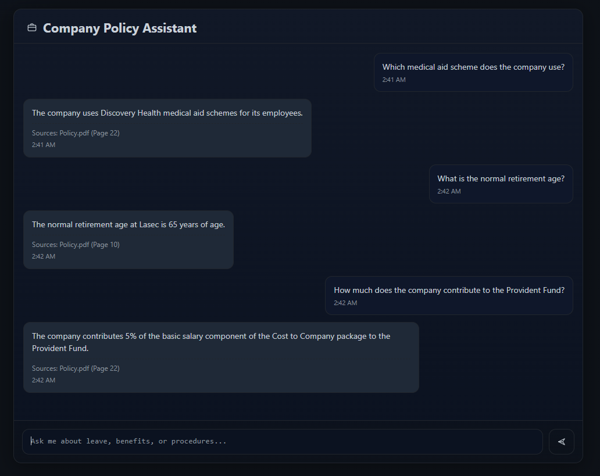

# AI Developer Task - Softvence Agency: Company Policy Assistant



## Features

- Ingests and stores company policy PDF documents
- Uses retrieval + generation to answer user queries
- Retrieves relevant chunks using embeddings and vector search
- Generates natural responses based only on retrieved context (no hallucination)
- Shows source citations with document name and page number
- Includes conversation history/memory for contextual interactions

## Workflow Summary

```
Policy PDFs → Text Extraction → Chunking → Embeddings → Pinecone Index
                                                              ↓
                  Employee Query → Similarity Search → Knowledge Base
                                                              ↓
                                                       Ranked Results → LLM → Answer + Sources
```

---

## Setup Guide

### Prerequisites

- Python 3.9 or higher
- Pinecone API key
- OpenAI API key

### Instructions

**1. Clone the Repository**
```bash
git clone https://github.com/AnthropoidFHJ/HR-Policy-Bot.git
cd HR-Policy-Bot
```

**2. Create Virtual Environment**
```bash
python -m venv .venv
```

Activate the environment:
- **Windows:** `.venv\Scripts\activate`
- **Linux/macOS:** `source .venv/bin/activate`

Install Dependencies
```bash
pip install -r requirements.txt
```

**3. Configure API Keys**

 - Create a `.env` file in the root directory:
```env
PINECONE_API_KEY="your_pinecone_api_key"
OPENAI_API_KEY="your_openai_api_key"
PINECONE_ENVIRONMENT="your_pinecone_environment"
```

**4. Add Policy Documents**

- Place your company policy PDF files in the `Data/` folder. Sample policies are included, or you can add your own HR/IT policy documents.

**5. Build the Knowledge Base**
```bash
python ingest.py
```

This script will:
- Create a Pinecone vector index
- Extract text from PDF documents
- Generate embeddings
- Upload vectors to Pinecone


**6. Run the Application**
```bash
python app.py
```

* Visit: [http://localhost:8080](http://localhost:8080)

 
## Tech Stack

* **Backend**: Flask
* **Frontend**: HTML/CSS
* **LLM**: OpenAI GPT-3.5-Turbo
* **Embeddings**: HuggingFace (`all-MiniLM-L6-v2`)
* **Vector Store**: Pinecone
* **Document Processing**: PyPDF2
* **Memory Management**: Session-based conversation history

## Demo Video

#### [▶️ Watch Video](https://youtu.be/uVc8FXeYZy0) ####
The video shows:
- Real-time query and response
- Source citation display
- Conversation history feature

---

**Author:** Md Ferdous Hasan  
**Date:** November 13, 2025  
